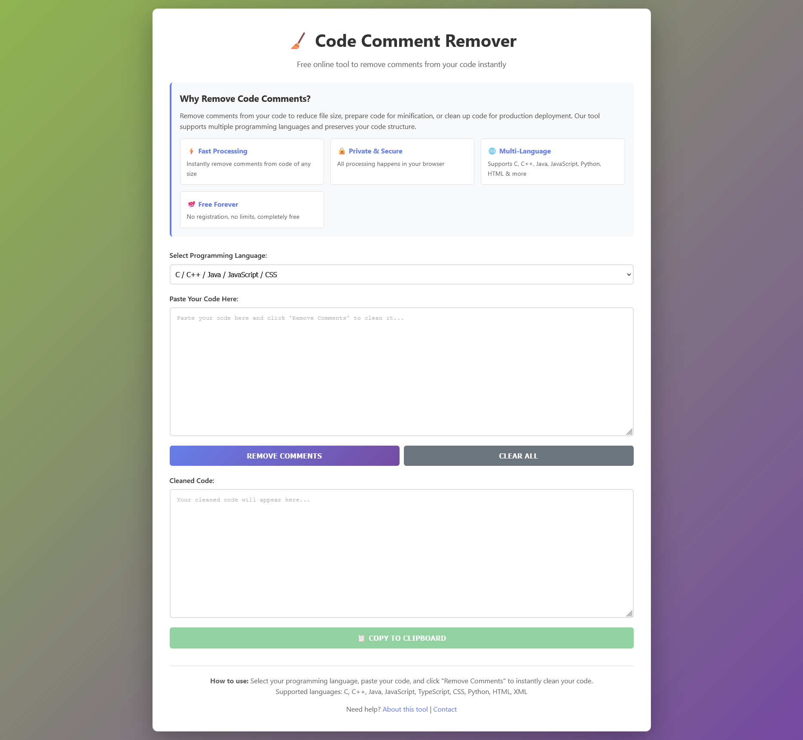

# 🧹 Code Comment Remover

A free, fast, and secure online tool to remove comments from your code. Supports multiple programming languages including C, C++, Java, JavaScript, Python, HTML, and XML.


## 🌟 Features

- **⚡ Fast Processing** - Instantly remove comments from code of any size
- **🔒 Private & Secure** - All processing happens in your browser, no server uploads
- **🌐 Multi-Language Support** - C, C++, Java, JavaScript, CSS, Python, HTML, XML
- **📊 Statistics** - View original/cleaned line counts and size reduction
- **📋 Copy to Clipboard** - One-click copy of cleaned code
- **💻 Keyboard Shortcuts** - Use Ctrl/Cmd + Enter to process
- **📱 Responsive Design** - Works perfectly on desktop, tablet, and mobile
- **💯 Free Forever** - No registration, no limits, completely free

## 🚀 Live Demo

Visit the live application: [Your Live URL Here]

## 📸 Screenshots



## 🛠️ Supported Languages

| Language | Single-Line Comments | Multi-Line Comments | String Handling |
|----------|---------------------|---------------------|-----------------|
| C/C++    | `//`                | `/* */`             | ✅              |
| Java     | `//`                | `/* */`             | ✅              |
| JavaScript | `//`              | `/* */`             | ✅              |
| CSS      | N/A                 | `/* */`             | ✅              |
| Python   | `#`                 | `"""` / `'''`       | ✅              |
| HTML     | N/A                 | `<!-- -->`          | ✅              |
| XML      | N/A                 | `<!-- -->`          | ✅              |

## 💡 How to Use

1. **Select Language** - Choose your programming language from the dropdown
2. **Paste Code** - Paste your code into the input textarea
3. **Remove Comments** - Click "Remove Comments" or press Ctrl/Cmd + Enter
4. **Copy Result** - Use the "Copy to Clipboard" button to copy the cleaned code

## 📦 Installation

### Clone the Repository

```bash
git clone https://github.com/YOUR-USERNAME/code-comment-remover.git
cd code-comment-remover
```

### Local Development

Simply open `index.html` in your browser. No build process or dependencies required!

```bash
# Open in default browser (Mac)
open index.html

# Open in default browser (Linux)
xdg-open index.html

# Open in default browser (Windows)
start index.html
```

## 🌐 Deployment

### GitHub Pages

1. Push your code to GitHub
2. Go to repository Settings → Pages
3. Select "main" branch as source
4. Your site will be live at `https://YOUR-USERNAME.github.io/code-comment-remover/`

### Netlify

1. Visit [Netlify](https://www.netlify.com)
2. Drag and drop your `index.html` file
3. Your site is instantly deployed!

### Vercel

```bash
npm i -g vercel
vercel
```

## 🔧 Technical Details

### Technologies Used

- **HTML5** - Semantic markup
- **CSS3** - Modern styling with gradients and animations
- **Vanilla JavaScript** - No dependencies, pure JS
- **Responsive Design** - Mobile-first approach

### Browser Support

- ✅ Chrome (latest)
- ✅ Firefox (latest)
- ✅ Safari (latest)
- ✅ Edge (latest)
- ✅ Opera (latest)

### Performance

- **Page Load**: < 500ms
- **Processing Time**: Instant (client-side)
- **File Size**: ~15KB (HTML only)
- **No External Dependencies**: Fully self-contained

## 🔐 Privacy & Security

- **100% Client-Side Processing** - Your code never leaves your browser
- **No Data Collection** - We don't store or track any data
- **No Cookies** - No tracking cookies or analytics
- **Open Source** - Fully transparent code

## 📝 Use Cases

- **Production Deployment** - Clean code before deployment
- **Code Minification** - Reduce file size for web applications
- **Code Sharing** - Remove internal comments before sharing
- **Learning** - Study code without comment clutter
- **Documentation** - Extract clean code examples

## 🤝 Contributing

Contributions are welcome! Here's how you can help:

1. Fork the repository
2. Create a feature branch (`git checkout -b feature/AmazingFeature`)
3. Commit your changes (`git commit -m 'Add some AmazingFeature'`)
4. Push to the branch (`git push origin feature/AmazingFeature`)
5. Open a Pull Request

### Development Guidelines

- Keep code simple and readable
- Test with various code samples
- Ensure mobile responsiveness
- Update documentation as needed

## 🐛 Bug Reports

Found a bug? Please open an issue with:

- Browser and version
- Steps to reproduce
- Expected vs actual behavior
- Code sample that causes the issue

## 📄 License

This project is licensed under the MIT License - see the [LICENSE](LICENSE) file for details.

```
MIT License

Copyright (c) 2024 Code Comment Remover

Permission is hereby granted, free of charge, to any person obtaining a copy
of this software and associated documentation files (the "Software"), to deal
in the Software without restriction, including without limitation the rights
to use, copy, modify, merge, publish, distribute, sublicense, and/or sell
copies of the Software, and to permit persons to whom the Software is
furnished to do so, subject to the following conditions:

The above copyright notice and this permission notice shall be included in all
copies or substantial portions of the Software.

THE SOFTWARE IS PROVIDED "AS IS", WITHOUT WARRANTY OF ANY KIND, EXPRESS OR
IMPLIED, INCLUDING BUT NOT LIMITED TO THE WARRANTIES OF MERCHANTABILITY,
FITNESS FOR A PARTICULAR PURPOSE AND NONINFRINGEMENT. IN NO EVENT SHALL THE
AUTHORS OR COPYRIGHT HOLDERS BE LIABLE FOR ANY CLAIM, DAMAGES OR OTHER
LIABILITY, WHETHER IN AN ACTION OF CONTRACT, TORT OR OTHERWISE, ARISING FROM,
OUT OF OR IN CONNECTION WITH THE SOFTWARE OR THE USE OR OTHER DEALINGS IN THE
SOFTWARE.
```

## 👨‍💻 Author

**Your Name**
- GitHub: [@YOUR-USERNAME](https://github.com/zyryc)
- Website: [yourwebsite.com](https://github.com/zyryc)

## 🙏 Acknowledgments

- Inspired by the need for a simple, secure code cleaning tool
- Thanks to all contributors and users
- Built with ❤️ for the developer community

## 📊 Roadmap

- [ ] Add more language support (Ruby, Go, Rust, PHP)
- [ ] Batch file processing
- [ ] Download cleaned code as file
- [ ] Dark mode toggle
- [ ] Code syntax highlighting
- [ ] VSCode extension
- [ ] API endpoint

## ⭐ Star History

If you find this project useful, please consider giving it a star!

---

**Made with ❤️ by developers, for developers**

[⬆ Back to Top](#-code-comment-remover)